This tutorial provides step-by-step instructions for building an N-Tier **ASP.NET Web API** application from scratch using **Trackable Entities**.

## Solution Creation

### 1. Create a new Trackable Web API Application

  - Create a **New Project**, select the **Trackable** category, then choose **Trackable Web API Application**.

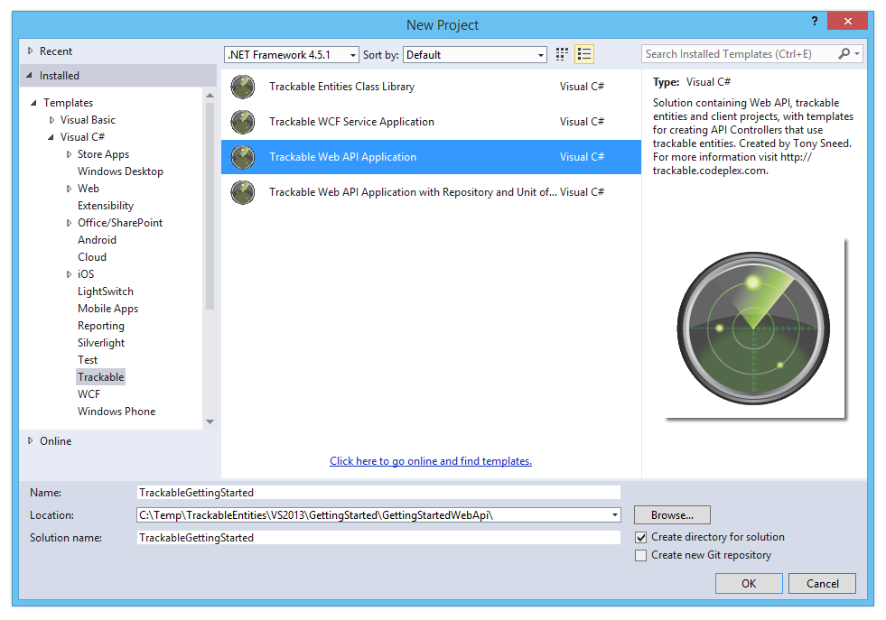

  **Solution Structure**: The wizard will create a new Visual Studio solution with the following projects:
  
  - ConsoleClient
  - Entities.Client.Portable
  - Entities.Service.Net45
  - WebApi

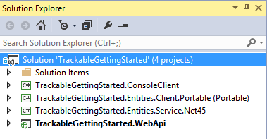

### 2. Choose the **kinds of entities** you would like to generate

  - **Client / Service Entities**: Generate **separate entities** for client and for service. Choose this option if you prefer entities which reflect a *greater separation of concerns*, for example, where client entities contain data binding and change tracking code but service entities do not.

  - **Shared Entities**: Generate **shared entities** in a .NET 4.5 class library that is *shared between client and for service*. Choose this option if you prefer *shared code* and less *code duplication*, for example, change tracking can be performed on both the client and service.

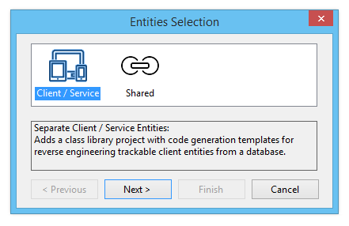

  **.NET 4.5 Entities**: Generate entities for a **.NET 4.5 Class Library** so that they can be used by client applications based on .NET 4.5 or greater.
  
  **Portable Entities**: Generate entities for a **Portable Class Library** so that they can be used by a variety of client applications, such as WPF, Windows Store, Windows Phone, iOS and Android.  *Note this option is available only for separate client / service entities*.

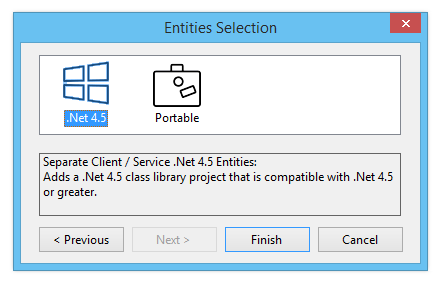

### 3. Update NuGet packages to the latest version

  - **Update Solution NuGet Packages**: Right-click *solution* and select **Manage NuGet packages for solution**.
  - Search for **trackable**, then update the *Trackable Client, Common, and EF6* packages to the latest version.

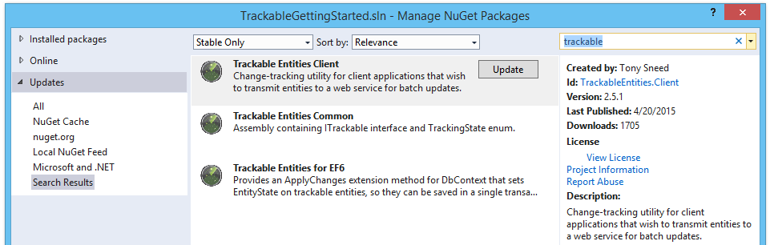

## Entity Generation

Trackable entities are generated with EF designer tools using *customizable* **T4 templates** included with class library projects created by the Visual Studio wizard. T4 templates may be replaced using one of the available **TrackableEntities.CodeTemplates** NuGet packages.

### 4. Generate Entities with EF 6.x Tools for Visual Studio

  - Add an **ADO.NET Entity Data Model** to the **Entities.Service.Net45** project. This option is also appropriate for *shared entities*.

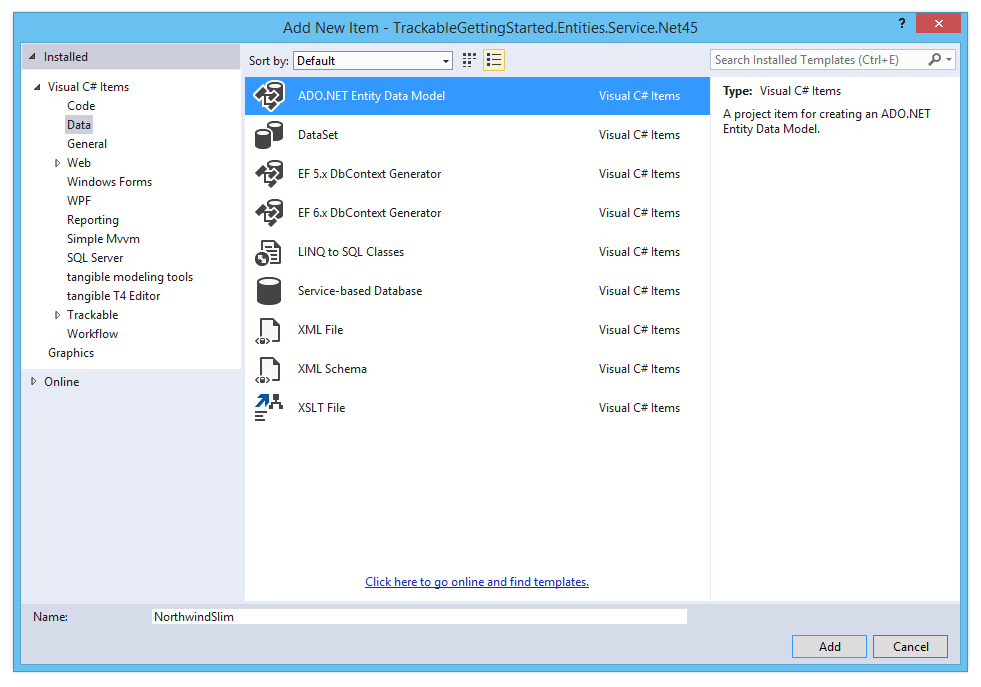

  - **Choose model contents**: Select either *EF Designer from database* or *Code First from database*. Code first is recommended, as EDMX models will be deprecated in a future version of Entity Framework.

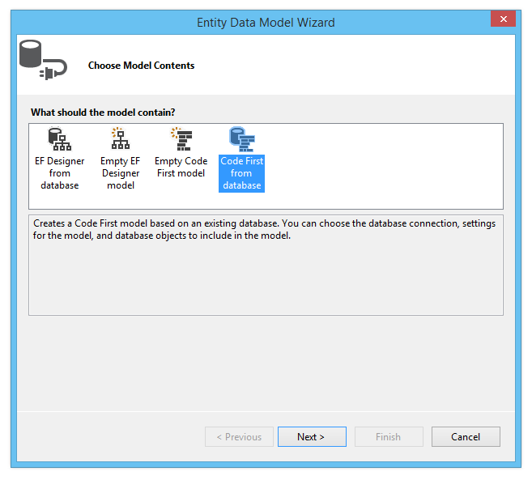

  - **Select or create a data connection**: If necessary create a new data connection to the NorthwindSlim database for SQL Express.  Make sure to *install the prerequisites* listed on the Trackable Entities [installation](1-installation.html) page.

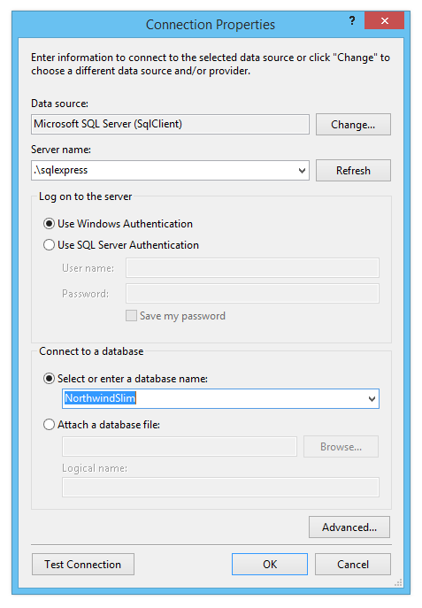

  - **Choose a data connection**: Confirm choice of a data connection and the connection string name in App.Config.

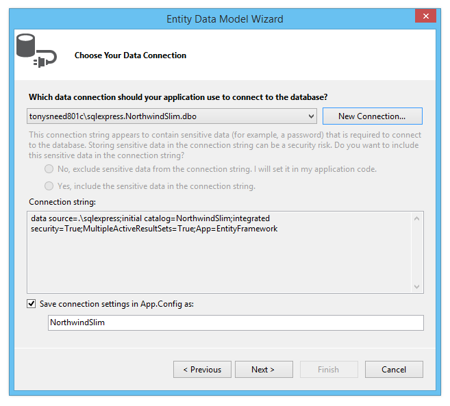

  - **Select tables**: Select which tables you wish to use for generating entities.

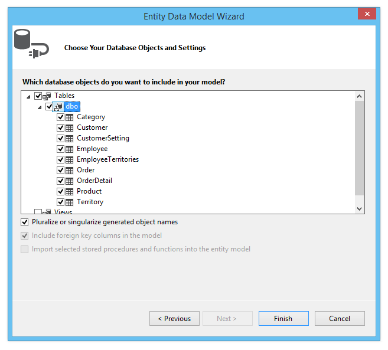

### 5. Generate Entities with EF Power Tools

  - Select the **Entities.Client.Portable** project. If necessary, install the *Entity Framework Power Tools* according to instructions on the [installation](1-installation.html) page.
  - It's also possible to create client entities using the EF 6.x Tools for Visual Studio, but if a **Portable Class Library** is desired, you would first create a .NET 4.5 Class Library and then link to entity classes from the Entities.Client.Portable project.
  - Right-click the **Entities.Client.Portable** project, select **Entity Framework**, then **Reverse Engineer Code First**.

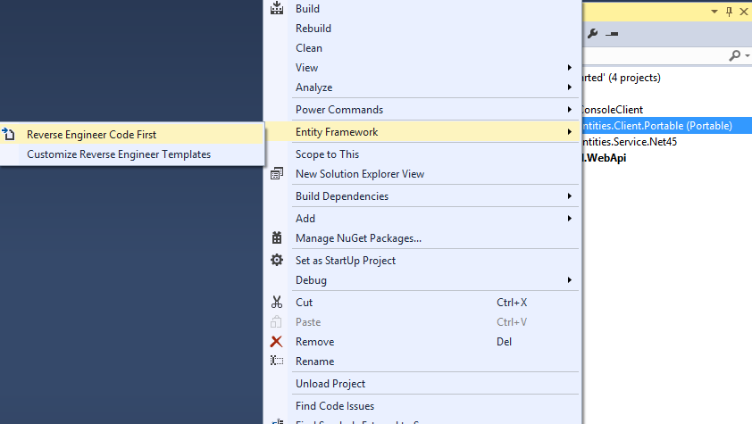

  **Important**: After the EF Power Tools wizard has finished generating entities, *delete* both the **NorthwindSlimContext.cs** file and the **Mapping** folder.

  - *Build the solution.*

## Web API Controllers

In this part you'll add *controllers* to the Web API project which perform CRUD operation (Create, Retrieve, Update and Delete) using trackable entities generated for the **Entities.Service.Net45** project.

### 6. Copy Database Connection String to Web.Config

- Copy the database connection string from the **App.config** file of the **Entities.Service.Net45** project to the *connectionStrings* section of the **Web.config** file of the **WebApi** project.

```xml
<connectionStrings>
  <add name="NorthwindSlim" connectionString="data source=.\sqlexpress;initial catalog=NorthwindSlim;integrated security=True;MultipleActiveResultSets=True;App=EntityFramework" providerName="System.Data.SqlClient" />
</connectionStrings>
```

### 7. Add controllers to the WebApi project

- Right-click the **Controllers** folder of the **WebApi** project and select **Add New Item**.
- Expand the **Trackable** category, then select the **Web** sub-category, then choose **Entity Web API Controller**, and enter the name of an *entity class* with the *Controller* suffix.

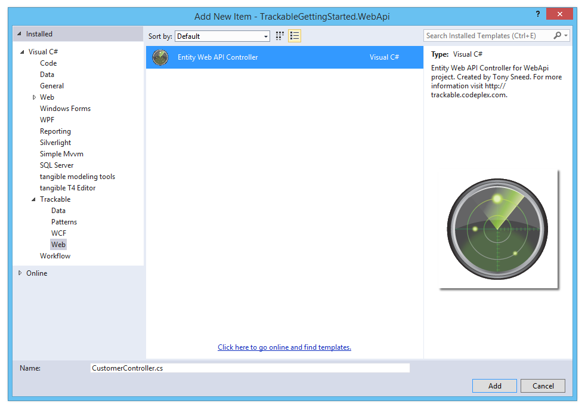

- Select an **entity name** from the dropdown list, type an **entity set name**, and select a **DbContext name** from the dropdown list.

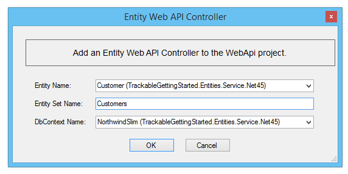

If necessary, change the type for the primary key property, for example from ```int``` to ```string```.

- The generated controller class should resemble something like the following:

```csharp
public class CustomerController : ApiController
{
    private readonly NorthwindSlim _dbContext = new NorthwindSlim();

    // GET api/Customer
    [ResponseType(typeof(IEnumerable<Customer>))]
    public async Task<IHttpActionResult> GetCustomers()
    {
        IEnumerable<Customer> entities = await _dbContext.Customers
            .ToListAsync();

        return Ok(entities);
    }

    // GET api/Customer/5
    [ResponseType(typeof(Customer))]
    public async Task<IHttpActionResult> GetCustomer(string id)
    {
        Customer entity = await _dbContext.Customers
            .SingleOrDefaultAsync(e => e.CustomerId == id);

        if (entity == null)
        {
            return NotFound();
        }

        return Ok(entity);
    }

    // POST api/Customer
    [ResponseType(typeof(Customer))]
    public async Task<IHttpActionResult> PostCustomer(Customer entity)
    {
        if (!ModelState.IsValid)
        {
            return BadRequest(ModelState);
        }

        entity.TrackingState = TrackingState.Added;
        _dbContext.ApplyChanges(entity);


        try
        {
            await _dbContext.SaveChangesAsync();
        }
        catch (DbUpdateException)
        {
            if (_dbContext.Customers.Any(e => e.CustomerId == entity.CustomerId))
            {
                return Conflict();
            }
            throw;
        }

        await _dbContext.LoadRelatedEntitiesAsync(entity);
        entity.AcceptChanges();
        return CreatedAtRoute("DefaultApi", new { id = entity.CustomerId }, entity);
    }

    // PUT api/Customer
    [ResponseType(typeof(Customer))]
    public async Task<IHttpActionResult> PutCustomer(Customer entity)
    {
        if (!ModelState.IsValid)
        {
            return BadRequest(ModelState);
        }

        _dbContext.ApplyChanges(entity);

        try
        {
            await _dbContext.SaveChangesAsync();
        }
        catch (DbUpdateConcurrencyException)
        {
            if (!_dbContext.Customers.Any(e => e.CustomerId == entity.CustomerId))
            {
                return Conflict();
            }
            throw;
        }

        await _dbContext.LoadRelatedEntitiesAsync(entity);
        entity.AcceptChanges();
        return Ok(entity);
    }

    // DELETE api/Customer/5
    public async Task<IHttpActionResult> DeleteCustomer(string id)
    {
        Customer entity = await _dbContext.Customers
            .SingleOrDefaultAsync(e => e.CustomerId == id);
        if (entity == null)
        {
            return Ok();
        }

        entity.TrackingState = TrackingState.Deleted;
        _dbContext.ApplyChanges(entity);

        try
        {
            await _dbContext.SaveChangesAsync();
        }
        catch (DbUpdateConcurrencyException)
        {
            if (!_dbContext.Customers.Any(e => e.CustomerId == entity.CustomerId))
            {
                return Conflict();
            }
            throw;
        }

        return Ok();
    }

    protected override void Dispose(bool disposing)
    {
        _dbContext.Dispose();
        base.Dispose(disposing);
    }
}
```

### 8. Test the Web API controller actions

- Build the solution, then browse to the WebApi project (Ctrl+Shift+W) to dispay the home page. Once there, click the **API** link to display the **Web API Help Page**.
- From there you can select a controller action and click the **Test API** button.  Then click the **Send** button to submit an HTTP request and view the response.


- Repeat the prior steps to add controllers for other entities to the **WebApi** project, for example, for ```Products``` and ```Orders```.

## Client Configuration

Now that controllers have been added to the **WebApi** project, it's time to configure the **ConsoleClient** to consume the Web API services by submitting HTTP requests for GET, POST, PUT and DELETE. Most importantly, the client will use the **TrackableEntities.Client** library to automatically track changes to entities that are added, modified or deleted.

### 9. Copy the Web API project's port number

- Copy the **port number** from the browser you used to test the Web API service, then paste it to replace the placeholder used for the port number in the ```Program.Main``` method of the **ConsoleClient** app.

### 10. Uncomment code in Program.Main to use the Web API service

- Uncomment code in ```Program.Main``` to retrieve customers from the Web API service and print them to the console.
- Also uncomment the **Service methods** and **Helper methods** in ```Program```.
- With the Web API service still running, you can set **ConsoleClient** as the solution *Startup Project*, then press **Ctrl+F5** to run it.  You should see a list of customers from the **NorthwindSlim** database printed to the console.

```csharp
class Program
{
    static void Main(string[] args)
    {
        Console.WriteLine("Press Enter to start");
        Console.ReadLine();

        // Create http client
        const string serviceBaseAddress = "http://localhost:" + "49424" + "/";
        var client = new HttpClient { BaseAddress = new Uri(serviceBaseAddress) };

        // Get customers
        Console.WriteLine("Customers:");
        IEnumerable<Customer> customers = GetCustomers(client);
        if (customers == null) return;
        foreach (var c in customers)
            PrintCustomer(c);
    }
}
```

### 11. Uncomment the rest of the code in Program.Main to create, update and delete entities

The purpose of Trackable Entities is to facilitate *change tracking across service boundaries*. It does this by setting a ```TrackingState``` on each entity on the client, then sending a graph or entities to the service, so that changes may be persisted in a **single transaction** and in a **single round trip** to the service.

- The remaining code in ```Program.Main``` will **create, update and delete** Orders and OrderDetails using a ```ChangeTrackingCollection<T>``` to perform client-side change-tracking.
- Before transmitting entities to the service, the client will invoke ```GetChanges``` on the change tracker in order to obtain only the entities which have been added, modified or deleted. This will improve performance by *not sending unchanged entities* over the wire.
- Once changes to entities have been persisted by the service, they will be returned to the client, along with r**elated entities** and **database generated values** (for example, *identity* and *concurrency* values). The client will then call ```MergeChanges``` on the change tracker in order to merge updates from the service back into the original entities on the client.
 