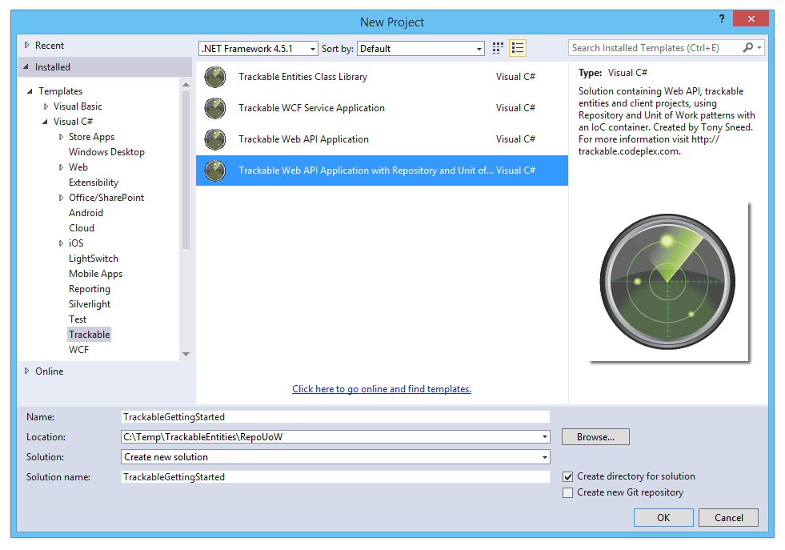
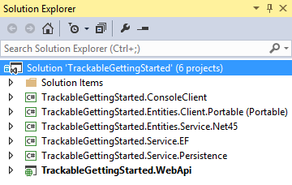
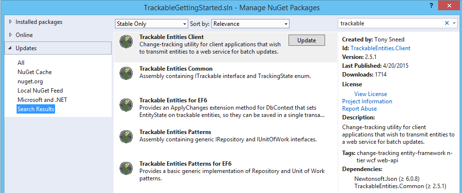
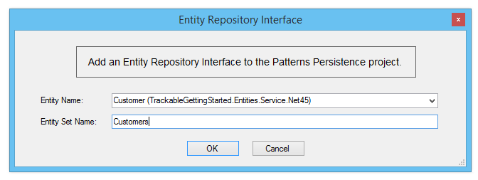
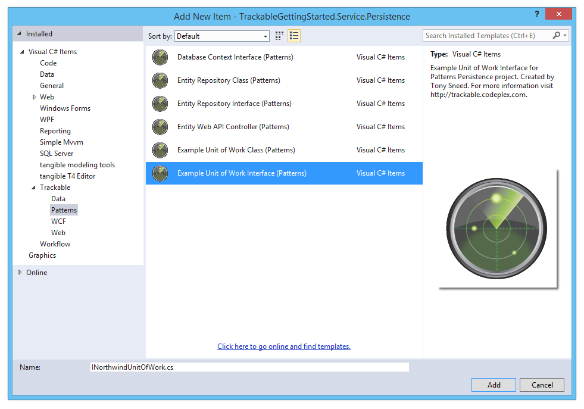
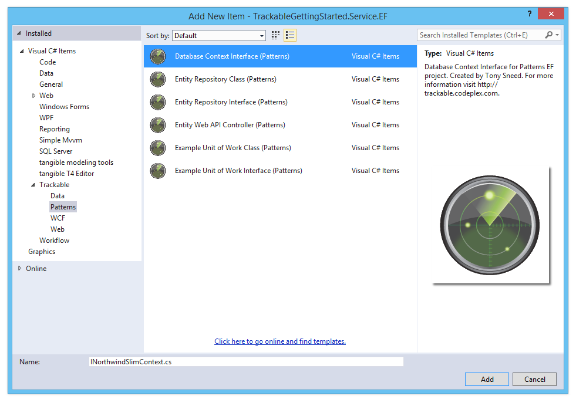
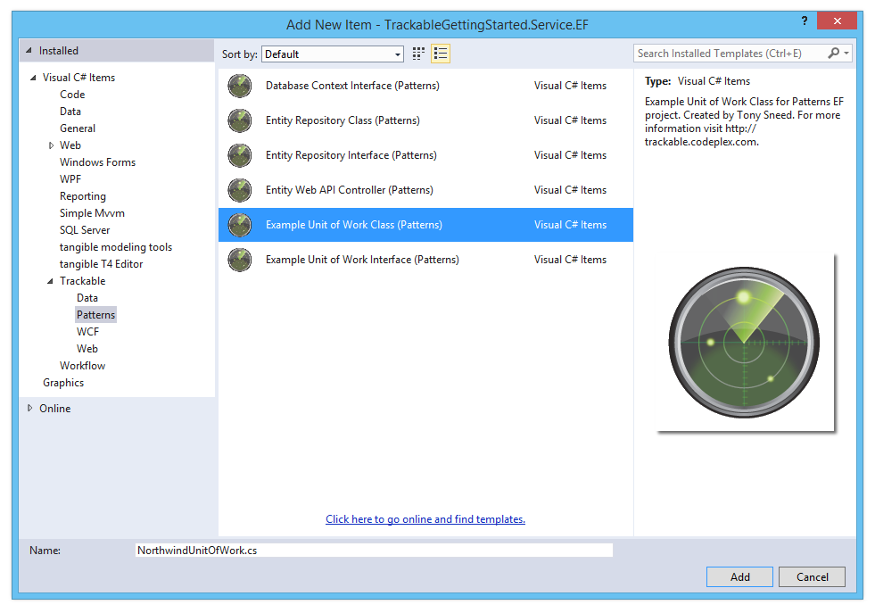
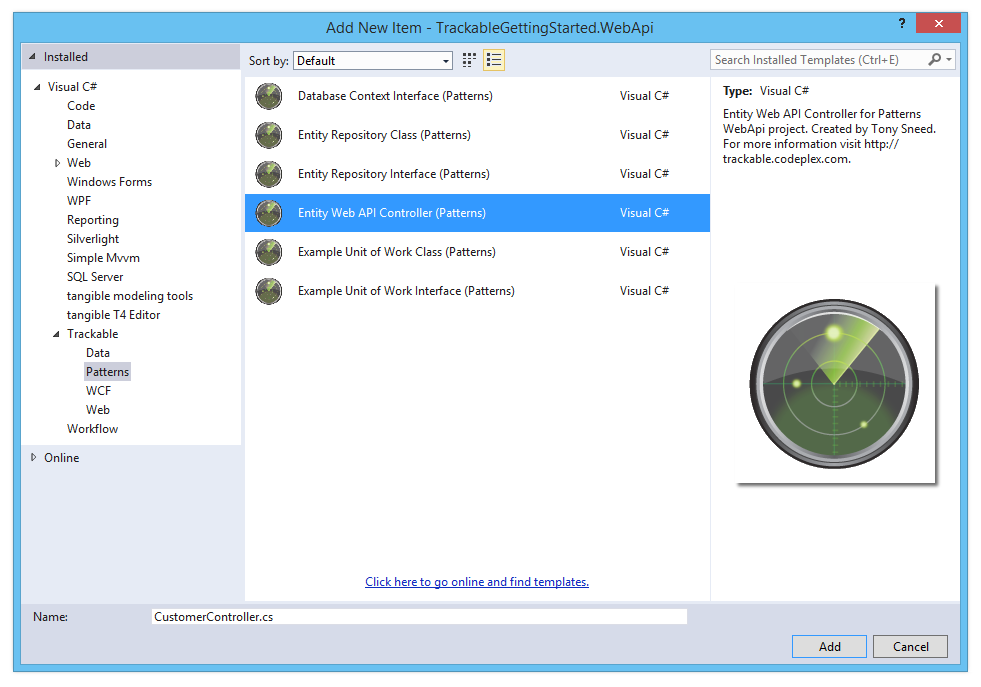
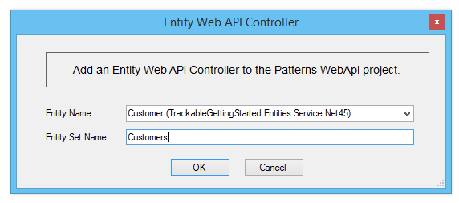

This tutorial provides step-by-step instructions for building an N-Tier **ASP.NET Web API** application from scratch using **Trackable Entities** with the **Repository and Unit of Work** patterns.

## Solution Creation

### 1. Create a new Trackable Web API Application with Repository and Unit of Work

  - Create a **New Project**, select the **Trackable** category, then choose **Trackable Web API Application with Repository and Unit of Work**.



  **Solution Structure**: The wizard will create a new Visual Studio solution with the following projects:
  
  - ConsoleClient
  - Entities.Client.Portable
  - Entities.Service.Net45
  - Service.EF
  - Service.Persistence
  - WebApi



### 2. Choose the **kinds of entities** you would like to generate

  - **Client / Service Entities**: Generate **separate entities** for client and for service. Choose this option if you prefer entities which reflect a *greater separation of concerns*, for example, where client entities contain data binding and change tracking code but service entities do not.

  - **Shared Entities**: Generate **shared entities** in a .NET 4.5 class library that is *shared between client and for service*. Choose this option if you prefer *shared code* and less *code duplication*, for example, change tracking can be performed on both the client and service.


  **.NET 4.5 Entities**: Generate entities for a **.NET 4.5 Class Library** so that they can be used by client applications based on .NET 4.5 or greater.
  
  **Portable Entities**: Generate entities for a **Portable Class Library** so that they can be used by a variety of client applications, such as WPF, Windows Store, Windows Phone, iOS and Android.  *Note this option is available only for separate client / service entities*.


### 3. Update NuGet packages to the latest version

  - **Update Solution NuGet Packages**: Right-click *solution* and select **Manage NuGet packages for solution**.
  - Search for **trackable**, then update the *Trackable Client, Common,  EF6, Patterns, and Patterns for EF6* packages to the latest version.
  - While you're at it, update the **Entity Framework** NuGet package to the latest *6.x version*.



## Entity Generation

Trackable entities are generated with EF designer tools using *customizable* **T4 templates** included with class library projects created by the Visual Studio wizard. T4 templates may be replaced using one of the available **TrackableEntities.CodeTemplates** NuGet packages.

### 4. Generate Entities with EF 6.x Tools for Visual Studio

  - Add an **ADO.NET Entity Data Model** to the **Entities.Service.Net45** project. This option is also appropriate for *shared entities*.


  - **Choose model contents**: Select either *EF Designer from database* or *Code First from database*. Code first is recommended, as EDMX models will be deprecated in a future version of Entity Framework.


  - **Select or create a data connection**: If necessary create a new data connection to the NorthwindSlim database for SQL Express.  Make sure to *install the prerequisites* listed on the Trackable Entities [installation](1-installation.html) page.


  - **Choose a data connection**: Confirm choice of a data connection and the connection string name in App.Config.


  - **Select tables**: Select which tables you wish to use for generating entities.


### 5. Generate Entities with EF Power Tools

  - Select the **Entities.Client.Portable** project. If necessary, install the *Entity Framework Power Tools* according to instructions on the [installation](1-installation.html) page.
  - It's also possible to create client entities using the EF 6.x Tools for Visual Studio, but if a **Portable Class Library** is desired, you would first create a .NET 4.5 Class Library and then link to entity classes from the Entities.Client.Portable project.
  - Right-click the **Entities.Client.Portable** project, select **Entity Framework**, then **Reverse Engineer Code First**.


  **Important**: After the EF Power Tools wizard has finished generating entities, *delete* both the **NorthwindSlimContext.cs** file and the **Mapping** folder.

  - *Build the solution.*

## Repositories

The repository pattern helps *abstract away* the data access API, which in our case is *Entity Framework*, for greater **flexibility** in case we want to replace it, and also to make our controllers more **testable**, allowing us to replace EF repositories with mocks.

### 6. Add Respository interfaces

- Add **repository interfaces** to the *Repositories folder* of the **Service.Persistence** project.
- Right-click the **Repositories** folder, *Add New Item*, *Trackable* category, *Patterns* subcategory, then select **Entity Repository Interface**.


- Select an **entity type** from the drop down list, then enter an **entity set name** (should be plural form of the class name).



- An **entity repository interface** will be added to the project. If necessary, change the *data type* of the ```id``` parameter to match the entity's **primary key** property.

```csharp
public interface ICustomerRepository : IRepository<Customer>, IRepositoryAsync<Customer>
{
    Task<IEnumerable<Customer>> GetCustomers();
    Task<Customer> GetCustomer(string id);
    Task<bool> DeleteCustomer(string id);
}
```

- Add *other entity repository interfaces* that are needed, for example, ```IOrderRepository```. For this guide, you'll want to modify the repository interface to include an overload of ```GetOrders``` that accepts a customerId of type ```string```.

```csharp
public interface IOrderRepository : IRepository<Order>, IRepositoryAsync<Order>
{
    Task<IEnumerable<Order>> GetOrders();
    Task<IEnumerable<Order>> GetOrders(string customerId);
    Task<Order> GetOrder(int id);
    Task<bool> DeleteOrder(int id);
}
```

### 6. Add a Unit of Work interface

The purpose of **Unit of Work** is to create operations, such as ```SaveChanges```, which span across *multiple repositories* in order to group updates from multiple repositories into a *single transaction*.

- Add a **Unit of Work interface** to the **UnitsOfwork** folder of the **Persistence** project.
- Right-click the **UnitsOfWork** folder, Add *New Item*, *Trackable* category, *Patterns* subcategory, then select **Example Unit of Work Interface**.  Give a name such as ```INorthwindUnitOfWork```.



- Add **read-only properties** for *each entity repository interface*.

```csharp
public interface INorthwindUnitOfWork : IUnitOfWork, IUnitOfWorkAsync
{
    ICustomerRepository CustomerRepository { get; }
    IOrderRepository OrderRepository { get; }
}
```

### 7. Add a DbContext interface

The DbContext interface serves as an abstraction of DbContext to the Unit of Work class, allowing the dependency injection framework to supply the strongly-typed DbContext class at runtime.

- Right-click the **Contexts** folder of the **Service.EF** project, Add *New Item*, *Trackable* category, *Patterns* subcategory, then select **Database Context Interface**.
- Enter a name for the file, for example, ```INorthwindSlimContext```.



- Add ```IDbSet<Entity>``` properties for each **entity set** on the **DbContext** class.

```csharp
public interface INorthwindSlimContext
{
    IDbSet<Category> Categories { get; set; }
    IDbSet<Customer> Customers { get; set; }
    IDbSet<Order> Orders { get; set; }
    IDbSet<OrderDetail> OrderDetails { get; set; }
    IDbSet<Product> Products { get; set; }
}
```

- Now copy the **DbContext** generated by the EF Power Tools from the **Service.Entities** project over to the **Contexts** folder in the **Service.EF** project.
- Then alter DbContext class to **implement this interface** and change each DbSet property to ```IDbSet```.

```csharp
public partial class NorthwindSlimContext : DbContext, INorthwindSlimContext
{
    public IDbSet<Category> Categories { get; set; }
    public IDbSet<Customer> Customers { get; set; }
    public IDbSet<CustomerSetting> CustomerSettings { get; set; }
    public IDbSet<Order> Orders { get; set; }
    public IDbSet<OrderDetail> OrderDetails { get; set; }
    public IDbSet<Product> Products { get; set; }

    // Other members elided for clarity
}
```

### 8. Add Entity Repository classes

- Right-click the **Repositories** folder, Add *New Item*, *Trackable* category, *Patterns* subcategory, then select **Entity Repository Class**. Enter a name such as ```CustomerRepository```, ```OrderRepository```.


- Rename **IDatabaseContext** to match the name of the Database Context Interface you added earlier, for example: ```INorthwindSlimContext```.
- If needed change the parameter type for the **Get** and **Delete** methods to match the *primary key property* of the entity.

```csharp
public class CustomerRepository : Repository<Customer>, ICustomerRepository
{
    private readonly INorthwindSlimContext _context;

    public CustomerRepository(INorthwindSlimContext context) :
        base(context as DbContext)
    {
        _context = context;
    }

    // Other members elided for clarity
}
```

- If needed add ```Include``` statements to *eagar-load* **related entities**.

```csharp
public async Task<IEnumerable<Order>> GetOrders()
{
    IEnumerable<Order> entities = await _context.Orders
        .Include(o => o.Customer)        // Include customer
        .Include("OrderDetails.Product") // Include details and products
        .ToListAsync();
    return entities;
}
```

### 9. Add a Unit of Work class

- Right-click the **UnitsOfWork** folder, Add *New Item*, *Trackable* category, *Patterns* subcategory, then select **Example Unit of Work Class**.
- Give the class a name such as ```NorthwindUnitOfWork```.



- Add **read-only fields** for each entity **repository interface**, for example:
```private readonly ICustomerRepository _customerRepository```
- Modify the class **ctor** by renaming ```IDatabaseContext``` to match the **context interface** you added earlier, for example: ```INorthwindSlimContext```.
- Then add *repository interface parameters* for each field you added,
and initialize each entity repository field using the ctor parameters.

```csharp
public class NorthwindUnitOfWork : UnitOfWork, INorthwindUnitOfWork
{
    private readonly ICustomerRepository _customerRepository;
    private readonly IOrderRepository _orderRepository;

    public NorthwindUnitOfWork(INorthwindSlimContext context,
        ICustomerRepository customerRepository,
        IOrderRepository orderRepository) :
        base(context as DbContext)
    {
        _customerRepository = customerRepository;
        _orderRepository = orderRepository;
    }

    public ICustomerRepository CustomerRepository
    {
        get { return _customerRepository; }
    }

    public IOrderRepository OrderRepository
    {
        get { return _orderRepository; }
    }

    // Other members elided for clarity
}
```

- Build the solution to make sure everything compiles.

## Web API Controllers

In this part you'll add *controllers* to the Web API project which perform CRUD operation (Create, Retrieve, Update and Delete) using trackable entities generated for the **Entities.Service.Net45** project.

### 10. Copy Database Connection String to Web.Config

- Copy the database connection string from the **App.config** file of the **Entities.Service.Net45** project to the *connectionStrings* section of the **Web.config** file of the **WebApi** project.

```xml
<connectionStrings>
  <add name="NorthwindSlim" connectionString="data source=.\sqlexpress;initial catalog=NorthwindSlim;integrated security=True;MultipleActiveResultSets=True;App=EntityFramework" providerName="System.Data.SqlClient" />
</connectionStrings>
```

### 11. Add controllers to the WebApi project

- Right-click the **Controllers** folder of the **WebApi** project and select **Add New Item**.
- Expand the **Trackable** category, then select the **Patterns** sub-category, then choose **Entity Web API Controller**, and enter the name of an *entity class* with the *Controller* suffix.



- Select an **entity name** from the dropdown list, type an **entity set name**, and select a **DbContext name** from the dropdown list.



- Rename **IExampleUnitOfWork** to match Unit of Work Interface added to **Persistence** project, for example: ```INorthwindUnitOfWork```.
- If necessary, change the type for the primary key property, for example from ```int``` to ```string```.

- The generated controller class should resemble something like the following:

```csharp
public class CustomerController : ApiController
{
    private readonly INorthwindUnitOfWork _unitOfWork;

    public CustomerController(INorthwindUnitOfWork unitOfWork)
    {
        _unitOfWork = unitOfWork;
    }

    // GET api/Customer
    [ResponseType(typeof(IEnumerable<Customer>))]
    public async Task<IHttpActionResult> GetCustomers()
    {
        IEnumerable<Customer> entities = await _unitOfWork.CustomerRepository.GetCustomers();
        return Ok(entities);
    }

    // GET api/Customer/5
    [ResponseType(typeof(Customer))]
    public async Task<IHttpActionResult> GetCustomer(int id)
    {
        Customer entity = await _unitOfWork.CustomerRepository.GetCustomer(id);
        if (entity == null)
        {
            return NotFound();
        }
        return Ok(entity);
    }

    // POST api/Customer
    [ResponseType(typeof(Customer))]
    public async Task<IHttpActionResult> PostCustomer(Customer entity)
    {
        if (!ModelState.IsValid)
        {
            return BadRequest(ModelState);
        }

        _unitOfWork.CustomerRepository.Insert(entity);

        try
        {
            await _unitOfWork.SaveChangesAsync();
        }
        catch (UpdateException)
        {
            if (_unitOfWork.CustomerRepository.Find(entity.CustomerId) == null)
            {
                return Conflict();
            }
            throw;
        }

        await _unitOfWork.CustomerRepository.LoadRelatedEntitiesAsync(entity);
        entity.AcceptChanges();

        return CreatedAtRoute("DefaultApi", new { id = entity.CustomerId }, entity);
    }

    // PUT api/Customer
    [ResponseType(typeof(Customer))]
    public async Task<IHttpActionResult> PutCustomer(Customer entity)
    {
        if (!ModelState.IsValid)
        {
            return BadRequest(ModelState);
        }

        _unitOfWork.CustomerRepository.Update(entity);

        try
        {
            await _unitOfWork.SaveChangesAsync();
        }
        catch (UpdateConcurrencyException)
        {
            if (_unitOfWork.CustomerRepository.Find(entity.CustomerId) == null)
            {
                return Conflict();
            }
            throw;
        }

        await _unitOfWork.CustomerRepository.LoadRelatedEntitiesAsync(entity);
        entity.AcceptChanges();
        return Ok(entity);
    }

    // DELETE api/Customer/5
    public async Task<IHttpActionResult> DeleteCustomer(int id)
    {
        bool result = await _unitOfWork.CustomerRepository.DeleteCustomer(id);
        if (!result) return Ok();

        try
        {
            await _unitOfWork.SaveChangesAsync();
        }
        catch (UpdateConcurrencyException)
        {
            if (_unitOfWork.CustomerRepository.Find(id) == null)
            {
                return Conflict();
            }
            throw;
        }

        return Ok();
    }

    protected override void Dispose(bool disposing)
    {
        if (disposing)
        {
            var disposable = _unitOfWork as IDisposable;
            if (disposable != null)
                disposable.Dispose();
        }
        base.Dispose(disposing);
    }
}
```

- Add other controllers as needed, for example: ```OrderController```.
- Add other **Get** methods supported by the Entity Repository Interface, for example: ```GetOrders(string customerId)```.

```csharp
// GET api/Order?customerId=ABCD
[ResponseType(typeof(IEnumerable<Order>))]
public async Task<IHttpActionResult> GetOrders(string customerId)
{
    IEnumerable<Order> orders = await _unitOfWork.OrderRepository.GetOrders(customerId);
    return Ok(orders);
}
```


### 12. Configure the Dependency Injection container

- Open **SimpleInjectorWebApiInitializer.cs** in the **AppStart** folder of the **WebApi** project.
- Uncomment the using directives: *EF.Contexts, EF.Repositories, EF.UnitsOfWork, Persistence.Repositories, Persistence.UnitsOfWork*.
- Uncomment code in the ```InitializeContainer``` method to **register types** with the DI container.
- Here is what the initializer class should look like:

```csharp
public static class SimpleInjectorWebApiInitializer
{
    public static void Initialize()
    {
        // Create IoC container
        var container = new Container();

        // Register dependencies
        InitializeContainer(container);
        container.RegisterWebApiControllers(GlobalConfiguration.Configuration);

        // Verify registrations
        container.Verify();

        // Set Web API dependency resolver
        GlobalConfiguration.Configuration.DependencyResolver =
            new SimpleInjectorWebApiDependencyResolver(container);
    }

    private static void InitializeContainer(Container container)
    {
        // Register context, unit of work and repos with per request lifetime
        container.RegisterWebApiRequest<INorthwindSlimContext, NorthwindSlimContext>();
        container.RegisterWebApiRequest<INorthwindUnitOfWork, NorthwindUnitOfWork>();
        container.RegisterWebApiRequest<ICustomerRepository, CustomerRepository>();
        container.RegisterWebApiRequest<IOrderRepository, OrderRepository>();
    }
}
```

### 13. Test the Web API controller actions

- Build the solution, then browse to the WebApi project (Ctrl+Shift+W) to dispay the home page. Once there, click the **API** link to display the **Web API Help Page**.
- From there you can select a controller action and click the **Test API** button.  Then click the **Send** button to submit an HTTP request and view the response.


- Repeat the prior steps to add controllers for other entities to the **WebApi** project, for example, for ```Products``` and ```Orders```.

## Retrieving Entities

Now that controllers have been added to the **WebApi** project, it's time to configure the **ConsoleClient** to retrieve customers and orders from the Web API service.

### 14. Retrieve customers and orders

- Copy the **port number** from the browser you used to test the Web API service, then paste it to replace the placeholder used for the port number in the ```Program.Main``` method of the **ConsoleClient** app.

- Uncomment code in ```Program.Main``` to retrieve customers from the Web API service and print them to the console.
- Also uncomment the **Service methods** and **Helper methods** in ```Program```.
- With the Web API service still running, you can set **ConsoleClient** as the solution *Startup Project*, then press **Ctrl+F5** to run it.  You should see a list of customers from the **NorthwindSlim** database printed to the console.

```csharp
class Program
{
    private static void Main(string[] args)
    {
        Console.WriteLine("Press Enter to start");
        Console.ReadLine();

        // Create http client
        const string serviceBaseAddress = "http://localhost:" + "49424" + "/";
        var client = new HttpClient {BaseAddress = new Uri(serviceBaseAddress)};

        // Get customers
        Console.WriteLine("Customers:");
        IEnumerable<Customer> customers = GetCustomers(client);
        if (customers == null) return;
        foreach (var c in customers)
            PrintCustomer(c);

        // Get orders for a customer
        Console.WriteLine("\nGet customer orders {CustomerId}:");
        string customerId = Console.ReadLine();
        if (!customers.Any(c => string.Equals(c.CustomerId, customerId, StringComparison.OrdinalIgnoreCase)))
        {
            Console.WriteLine("Invalid customer id: {0}", customerId.ToUpper());
            return;
        }
        IEnumerable<Order> orders = GetCustomerOrders(client, customerId);
        foreach (var o in orders)
            PrintOrder(o);

        // Get an order
        Console.WriteLine("\nGet an order {OrderId}:");
        int orderId = int.Parse(Console.ReadLine());
        if (!orders.Any(o => o.OrderId == orderId))
        {
            Console.WriteLine("Invalid order id: {0}", orderId);
            return;
        }
        Order order = GetOrder(client, orderId);
        PrintOrderWithDetails(order);

        // TODO: Create an order, then update and delete it
    }
}
```

- The following client methods are used to **retrieve** entities.

```csharp
private static IEnumerable<Customer> GetCustomers(HttpClient client)
{
    const string request = "api/Customer";
    var response = client.GetAsync(request).Result;
    response.EnsureSuccessStatusCode();
    var result = response.Content.ReadAsAsync<IEnumerable<Customer>>().Result;
    return result;
}

private static IEnumerable<Order> GetCustomerOrders
    (HttpClient client, string customerId)
{
    string request = "api/Order?customerId=" + customerId;
    var response = client.GetAsync(request).Result;
    response.EnsureSuccessStatusCode();
    var result = response.Content.ReadAsAsync<IEnumerable<Order>>().Result;
    return result;
}

private static Order GetOrder(HttpClient client, int orderId)
{
    string request = "api/Order/" + orderId;
    var response = client.GetAsync(request).Result;
    response.EnsureSuccessStatusCode();
    var result = response.Content.ReadAsAsync<Order>().Result;
    return result;
}
```

## Updating Entities

Next we'll add code to **ConsoleClient** for **creating** a new order, then **updating** the order by *adding, removing and deleting details*.  Lastly, we'll **delete** the order we created and confirm that it was in fact deleted.

### 15. Create an order

- Create a **new order** with details. Populate the *foreign key values* for the ```CustomerId``` property of the order, as well as ```ProductId``` for each detail.

```csharp
// Create a new order
Console.WriteLine("\nPress Enter to create a new order for {0}",
    customerId.ToUpper());
Console.ReadLine();

var newOrder = new Order
{
    CustomerId = customerId,
    OrderDate = DateTime.Today,
    ShippedDate = DateTime.Today.AddDays(1),
    OrderDetails = new ChangeTrackingCollection<OrderDetail>
        {
            new OrderDetail { ProductId = 1, Quantity = 5, UnitPrice = 10 },
            new OrderDetail { ProductId = 2, Quantity = 10, UnitPrice = 20 },
            new OrderDetail { ProductId = 4, Quantity = 40, UnitPrice = 40 }
        }
};
var createdOrder = CreateOrder(client, newOrder);
PrintOrderWithDetails(createdOrder);
```

### 16. Update the order and details

- Start **change tracking** the order by adding it to a new ```ChangeTrackingCollection```.
- Add a new detail, modify an existing detail, then remove a detail. Leave one detail unchanged.
- Call ```GetChanges``` on the change tracker to obtain *only items which have been added, updated or deleted*. This will help us avoid sending unchanged entities to the service.
- After sending changes to the service **PUT operation** for updating, call ```MergeChanges``` on the change tracker, passing the updated order returned by the PUT operation.  This will ensure that database-generated values (for example identity and concurrency) will be merged back into the original object graph.

```csharp
// Update the order
Console.WriteLine("\nPress Enter to update order details");
Console.ReadLine();

// Start change-tracking the order
var changeTracker = new ChangeTrackingCollection<Order>(createdOrder);

// Modify order details
createdOrder.OrderDetails[0].UnitPrice++;
createdOrder.OrderDetails.RemoveAt(1);
createdOrder.OrderDetails.Add(new OrderDetail
{
    OrderId = createdOrder.OrderId,
    ProductId = 3,
    Quantity = 15,
    UnitPrice = 30
});

// Submit changes
var changedOrder = changeTracker.GetChanges().SingleOrDefault();
var updatedOrder = UpdateOrder(client, changedOrder);

// Merge changes
changeTracker.MergeChanges(updatedOrder);
Console.WriteLine("Updated order:");
PrintOrderWithDetails(createdOrder);
```

### 17. Delete the order and confirm that delete was successful

- To delete the order, we simply pass the ```OrderId``` to the **DELETE** service operation.
- To confirm that the delete was successful, simply call **GET** and pass the id of the deleted order. The operation will return null if the order was deleted.

```csharp
// Delete the order
Console.WriteLine("\nPress Enter to delete the order");
Console.ReadLine();
DeleteOrder(client, createdOrder);

// Verify order was deleted
var deleted = VerifyOrderDeleted(client, createdOrder.OrderId);
Console.WriteLine(deleted ?
    "Order was successfully deleted" :
    "Order was not deleted");

// Keep console open
Console.WriteLine("Press any key to exit");
Console.ReadKey(true);
```

- The following client methods are used to **udpate** entities.

```csharp
private static Order CreateOrder(HttpClient client, Order order)
{
    string request = "api/Order";
    var response = client.PostAsJsonAsync(request, order).Result;
    response.EnsureSuccessStatusCode();
    var result = response.Content.ReadAsAsync<Order>().Result;
    return result;
}

private static Order UpdateOrder(HttpClient client, Order order)
{
    string request = "api/Order";
    var response = client.PutAsJsonAsync(request, order).Result;
    response.EnsureSuccessStatusCode();
    var result = response.Content.ReadAsAsync<Order>().Result;
    return result;
}

private static void DeleteOrder(HttpClient client, Order order)
{
    string request = "api/Order/" + order.OrderId;
    var response = client.DeleteAsync(request);
    response.Result.EnsureSuccessStatusCode();
}
```
