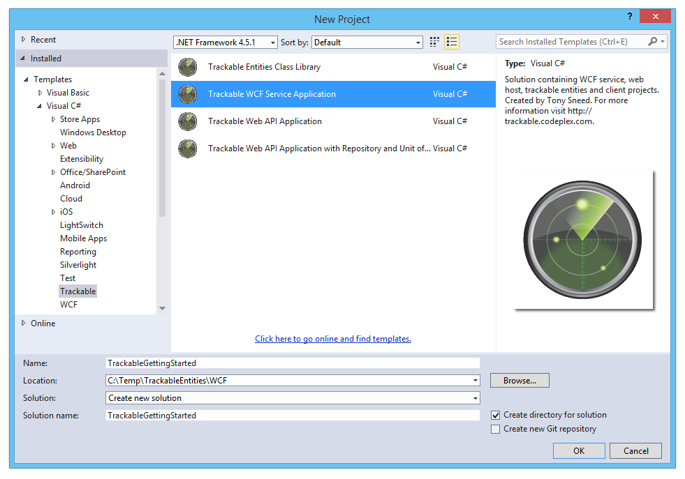
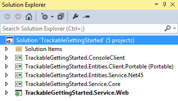
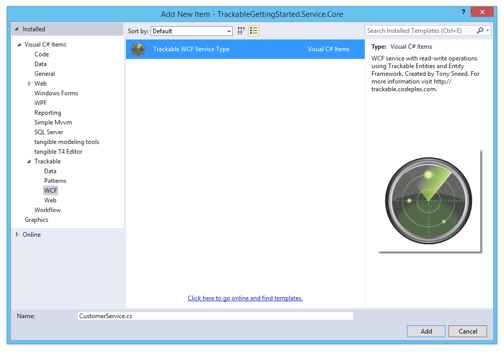
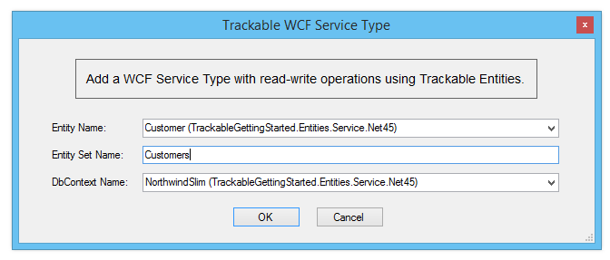
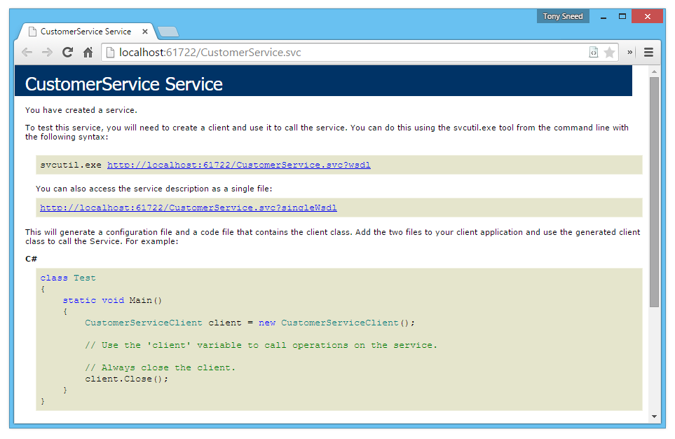

This tutorial provides step-by-step instructions for building an N-Tier **Windows Communication Foundation** application from scratch using **Trackable Entities**.

## Solution Creation

### 1. Create a new Trackable WCF Application

  - Create a **New Project**, select the **Trackable** category, then choose **Trackable WCF Application**.



  **Solution Structure**: The wizard will create a new Visual Studio solution with the following projects:
  
  - ConsoleClient
  - Entities.Client.Portable
  - Entities.Service.Net45
  - Core
  - Web



### 2. Choose the **kinds of entities** you would like to generate

  - **Client / Service Entities**: Generate **separate entities** for client and for service. Choose this option if you prefer entities which reflect a *greater separation of concerns*, for example, where client entities contain data binding and change tracking code but service entities do not.

  - **Shared Entities**: Generate **shared entities** in a .NET 4.5 class library that is *shared between client and for service*. Choose this option if you prefer *shared code* and less *code duplication*, for example, change tracking can be performed on both the client and service.


  **.NET 4.5 Entities**: Generate entities for a **.NET 4.5 Class Library** so that they can be used by client applications based on .NET 4.5 or greater.
  
  **Portable Entities**: Generate entities for a **Portable Class Library** so that they can be used by a variety of client applications, such as WPF, Windows Store, Windows Phone, iOS and Android.  *Note this option is available only for separate client / service entities*.


### 3. Update NuGet packages to the latest version

  - **Update Solution NuGet Packages**: Right-click *solution* and select **Manage NuGet packages for solution**.
  - Search for **trackable**, then update the *Trackable Client, Common, and EF6* packages to the latest version.
  - While you're at it, update the **Entity Framework** NuGet package to the latest *6.x version*.


## Entity Generation

Trackable entities are generated with EF designer tools using *customizable* **T4 templates** included with class library projects created by the Visual Studio wizard. T4 templates may be replaced using one of the available **TrackableEntities.CodeTemplates** NuGet packages.

### 4. Generate Entities with EF 6.x Tools for Visual Studio

  - **Important**: As of v2.5 Trackable Entities generates entities that are *free of serialization attributes*, therefore the **[DataContract]** attribute is no longer included. For this reason, if you select the option for separate client / service entities, each entities project will have the **same default namespace**. If you would like to add these projects manually, *be sure that the default namespaces match*.
  
  - Add an **ADO.NET Entity Data Model** to the **Entities.Service.Net45** project. This option is also appropriate for *shared entities*.


  - **Choose model contents**: Select either *EF Designer from database* or *Code First from database*. Code first is recommended, as EDMX models will be deprecated in a future version of Entity Framework.


  - **Select or create a data connection**: If necessary create a new data connection to the NorthwindSlim database for SQL Express.  Make sure to *install the prerequisites* listed on the Trackable Entities [installation](1-installation.html) page.


  - **Choose a data connection**: Confirm choice of a data connection and the connection string name in App.Config.


  - **Select tables**: Select which tables you wish to use for generating entities.


### 5. Generate Entities with EF Power Tools

  - Select the **Entities.Client.Portable** project. If necessary, install the *Entity Framework Power Tools* according to instructions on the [installation](1-installation.html) page.
  - It's also possible to create client entities using the EF 6.x Tools for Visual Studio, but if a **Portable Class Library** is desired, you would first create a .NET 4.5 Class Library and then link to entity classes from the Entities.Client.Portable project.
  - Right-click the **Entities.Client.Portable** project, select **Entity Framework**, then **Reverse Engineer Code First**.


  **Important**: After the EF Power Tools wizard has finished generating entities, *delete* both the **NorthwindSlimContext.cs** file and the **Mapping** folder.

  - **Important**: Because WCF requires that client and service entities *share the same namespace*, you should **move** the **service entities** *into the Models folder* and add **.Models** to the namespace for each entity class.

  - *Build the solution.*

## WCF Service Types

In this part you'll add *WCF service types* to the **Core** project to perform CRUD operation (Create, Retrieve, Update and Delete) using trackable entities generated for the **Entities.Service.Net45** project.

### 6. Copy Database Connection String to Web.Config

- Copy the database connection string from the **App.config** file of the **Entities.Service.Net45** project to the *connectionStrings* section of the **Web.config** file of the **Web** project.

```xml
<connectionStrings>
  <add name="NorthwindSlim" connectionString="data source=.\sqlexpress;initial catalog=NorthwindSlim;integrated security=True;MultipleActiveResultSets=True;App=EntityFramework" providerName="System.Data.SqlClient" />
</connectionStrings>
```

### 7. Add service types to the Core project

- Right-click the **Core** project and select **Add New Item**.
- Expand the **Trackable** category, then select the **WCF** sub-category, then choose **Trackable WCF Service Type**, and enter the name of an *entity class* with the *Service* suffix.



- Select an **entity name** from the dropdown list, type an **entity set name**, and select a **DbContext name** from the dropdown list.



- If necessary, change the type for the primary key property, for example from ```int``` to ```string```.
- Uncomment the ```DataContractSerializerPreserveReferences``` attribute in order to configure the serializer to handle cyclical references.

- The generated **service class** should resemble something like the following:

```csharp
[DataContractSerializerPreserveReferences]
[ServiceContract(Namespace = "urn:trackable-entities:service")]
public interface ICustomerService
{
    [OperationContract]
    Task<IEnumerable<Customer>> GetCustomers();

    [OperationContract]
    Task<Customer> GetCustomer(string id);

    [OperationContract]
    Task<Customer> UpdateCustomer(Customer entity);

    [OperationContract]
    Task<Customer> CreateCustomer(Customer entity);

    [OperationContract]
    Task<bool> DeleteCustomer(string id);
}
```

- Now add an **Order** service type to the **Core** project.
- Add a ```GetOrders``` method that accepts a ```customerId``` parameter of type ```string``` and filters orders by the specified customer id.
- Update all the **Get** methods in to use the ```Include``` operator for eager-loading **Customer, OrderDetails, and Product** properties. Note you'll want to use an overload of ```Include``` that accepts a ```string```, so that you can pass a **dot-delimitted path** for "OrderDetails.Product".  *This will fetch all the details for an order and will populate the products for each detail.*
- Also modify the **Delete** method to include order details: ```.Include(e => e.OrderDetails)```

```csharp
[DataContractSerializerPreserveReferences]
[ServiceContract(Namespace = "urn:trackable-entities:service")]
public interface IOrderService
{
    [OperationContract]
    Task<IEnumerable<Order>> GetOrders();

    [OperationContract]
    Task<IEnumerable<Order>> GetCustomerOrders(string customerId);

    [OperationContract]
    Task<Order> GetOrder(int id);

    [OperationContract]
    Task<Order> UpdateOrder(Order entity);

    [OperationContract]
    Task<Order> CreateOrder(Order entity);

    [OperationContract]
    Task<bool> DeleteOrder(int id);
}

[ServiceBehavior(InstanceContextMode = InstanceContextMode.PerCall)]
public class OrderService : IOrderService, IDisposable
{
    private readonly NorthwindSlim _dbContext;

    public OrderService()
    {
        _dbContext = new NorthwindSlim();
    }

    public async Task<IEnumerable<Order>> GetOrders()
    {
        IEnumerable<Order> entities = await _dbContext.Orders
            .Include(e => e.Customer)
            .Include("OrderDetails.Product")
            .ToListAsync();
        return entities;
    }

    public async Task<IEnumerable<Order>> GetCustomerOrders(string customerId)
    {
        IEnumerable<Order> entities = await _dbContext.Orders
            .Include(e => e.Customer)
            .Include("OrderDetails.Product")
            .Where(e => e.CustomerId == customerId)
            .ToListAsync();
        return entities;
    }

    public async Task<Order> GetOrder(int id)
    {
        Order entity = await _dbContext.Orders
            .Include(e => e.Customer)
            .Include("OrderDetails.Product")
            .SingleOrDefaultAsync(e => e.OrderId == id);
        return entity;
    }

    public async Task<Order> CreateOrder(Order entity)
    {
        entity.TrackingState = TrackingState.Added;
        _dbContext.ApplyChanges(entity);

        try
        {
            await _dbContext.SaveChangesAsync();
        }
        catch (DbUpdateException updateEx)
        {
            throw new FaultException(updateEx.Message);
        }

        await _dbContext.LoadRelatedEntitiesAsync(entity);
        entity.AcceptChanges();
        return entity;
    }

    public async Task<Order> UpdateOrder(Order entity)
    {
        _dbContext.ApplyChanges(entity);

        try
        {
            await _dbContext.SaveChangesAsync();
        }
        catch (DbUpdateConcurrencyException updateEx)
        {
            throw new FaultException(updateEx.Message);
        }

        await _dbContext.LoadRelatedEntitiesAsync(entity);
        entity.AcceptChanges();
        return entity;
    }

    public async Task<bool> DeleteOrder(int id)
    {
        Order entity = await _dbContext.Orders
            .Include(e => e.OrderDetails)
            .SingleOrDefaultAsync(e => e.OrderId == id);
        if (entity == null)
            return false;

        entity.TrackingState = TrackingState.Deleted;
        _dbContext.ApplyChanges(entity);

        try
        {
            await _dbContext.SaveChangesAsync();
            return true;
        }
        catch (DbUpdateConcurrencyException updateEx)
        {
            throw new FaultException(updateEx.Message);
        }
    }

    public void Dispose()
    {
        var dispose = _dbContext as IDisposable;
        if (dispose != null)
        {
            _dbContext.Dispose();
        }
    }
}
```

- Build the solution.

### 8. Test the Web host

- Open the **Web** project in the solution explorer and rename **ExampleService.svc** to **CustomerService.svc.**
- Open the **svc** file and rename ```ExampleService``` to ```CustomerService```.
- Copy **CustomerService.svc.** to **OrderService.svc.** and rename the service type in the same way.
- Right-click on each of the **svc** files in the **Web** project, and select View in Browser.  *You should see the service metadata help page displayed.*



## Retrieving Entities

Now that services have been added to the **Core** project and hosted in the **Web** project, it's time to configure the **ConsoleClient** to retrieve customers and orders from the WCF service.

### 9. Retrieve customers and orders

- Rename **IExampleService.cs** to match the service type interfaces from the **Core** project, for example: ```ICustomerService```, ```IOrderService```.
- Uncomment the code and update to match the service type interfaces from the **Core** project.

```csharp
[ServiceContract(Namespace = "urn:trackable-entities:service")]
public interface ICustomerService
{
    [OperationContract(Name = "GetCustomers")]
    Task<IEnumerable<Customer>> GetCustomersAsync();

    [OperationContract(Name = "GetCustomer")]
    Task<Customer> GetCustomerAsync(int id);

    [OperationContract(Name = "UpdateCustomer")]
    Task<Customer> UpdateCustomerAsync(Customer entity);

    [OperationContract(Name = "CreateCustomer")]
    Task<Customer> CreateCustomerAsync(Customer entity);

    [OperationContract(Name = "DeleteCustomer")]
    Task<bool> DeleteCustomerAsync(int id);
}
```

- Repeat this for the order service type interface, and don't forget to include any methods you added to the service contract, such as ```GetCustomerOrders```.

```csharp
[ServiceContract(Namespace = "urn:trackable-entities:service")]
public interface IOrderService
{
    [OperationContract(Name = "GetOrders")]
    Task<IEnumerable<Order>> GetOrdersAsync();

    [OperationContract(Name = "GetCustomerOrders")]
    Task<IEnumerable<Order>> GetCustomerOrdersAsync(string customerId);

    [OperationContract(Name = "GetOrder")]
    Task<Order> GetOrderAsync(int id);

    [OperationContract(Name = "UpdateOrder")]
    Task<Order> UpdateOrderAsync(Order entity);

    [OperationContract(Name = "CreateOrder")]
    Task<Order> CreateOrderAsync(Order entity);

    [OperationContract(Name = "DeleteOrder")]
    Task<bool> DeleteOrderAsync(int id);
}
```

- Copy the **port number** from the browser you used to test the WCF service, then paste it to replace the placeholder used for the port number in **App.config**.  Uncomment the endpoint section, then rename Example to Customer. Copy the endpoint for Order.
- You may also wish to increase the maxReceivedMessageSize and maxBufferSize parameters of the basicHttpBinding configuration to increase their values.

```xml
<system.serviceModel>
  <bindings>
    <basicHttpBinding>
      <binding maxReceivedMessageSize="2147483647"
                maxBufferSize="2147483647">
      </binding>
    </basicHttpBinding>
  </bindings>
  <client>
    <endpoint address="http://localhost:50198/CustomerService.svc"
              binding="basicHttpBinding"
              contract="TrackableGettingStarted.ConsoleClient.ICustomerService"
              name="customerService">
    </endpoint>
    <endpoint address="http://localhost:50198/OrderService.svc"
              binding="basicHttpBinding"
              contract="TrackableGettingStarted.ConsoleClient.IOrderService"
              name="orderService">
    </endpoint>
  </client>
</system.serviceModel>
```

- Uncomment code in ```Program.Main``` to retrieve customers from the WCF service and print them to the console.
- Also uncomment the **Helper methods** in ```Program```.

```csharp
class Program
{
    private static void Main(string[] args)
    {
        // Main method

        Console.WriteLine("Press Enter to start");
        Console.ReadLine();

        ICustomerService customerService = new ChannelFactory<ICustomerService>("customerService").CreateChannel();
        IOrderService orderService = new ChannelFactory<IOrderService>("orderService").CreateChannel();

        using ((IDisposable) customerService)
        using ((IDisposable) orderService)
        {
            try
            {
                // Get customers
                Console.WriteLine("Customers:");
                IEnumerable<Customer> customers = customerService.GetCustomersAsync().Result;
                if (customers == null) return;
                foreach (var c in customers)
                    PrintCustomer(c);

                // Get orders for a customer
                Console.WriteLine("\nGet customer orders {CustomerId}:");
                string customerId = Console.ReadLine();
                if (!customers.Any(c => string.Equals(c.CustomerId, customerId, StringComparison.OrdinalIgnoreCase)))
                {
                    Console.WriteLine("Invalid customer id: {0}", customerId.ToUpper());
                    return;
                }
                IEnumerable<Order> orders = orderService.GetCustomerOrdersAsync(customerId).Result;
                foreach (var o in orders)
                    PrintOrder(o);

                // Get an order
                Console.WriteLine("\nGet an order {OrderId}:");
                int orderId = int.Parse(Console.ReadLine());
                if (!orders.Any(o => o.OrderId == orderId))
                {
                    Console.WriteLine("Invalid order id: {0}", orderId);
                    return;
                }
                Order order = orderService.GetOrderAsync(orderId).Result;
                PrintOrderWithDetails(order);

                // TODO: Create an order, then update and delete it
            }
            catch (AggregateException aggEx)
            {
                var baseEx = aggEx.Flatten().GetBaseException();
                var innerExMsg = baseEx.InnerException != null ? "\r\n" + baseEx.InnerException.Message : "";
                Console.WriteLine(baseEx.Message + innerExMsg);
            }
            finally
            {
                var channel = customerService as IClientChannel;
                if (channel != null && channel.State == CommunicationState.Faulted)
                {
                    channel.Abort();
                }
            }

            // Keep console open
            Console.WriteLine("Press any key to exit");
            Console.ReadKey(true);
        }
    }
}
```

- With the **Web** service still running, you can set **ConsoleClient** as the solution *Startup Project*, then press **Ctrl+F5** to run it.  You should see a list of customers from the **NorthwindSlim** database printed to the console.

## Updating Entities

Next we'll add code to **ConsoleClient** for **creating** a new order, then **updating** the order by *adding, removing and deleting details*.  Lastly, we'll **delete** the order we created and confirm that it was in fact deleted.

### 10. Create an order

- Create a **new order** with details. Populate the *foreign key values* for the ```CustomerId``` property of the order, as well as ```ProductId``` for each detail.

```csharp
// Create a new order
Console.WriteLine("\nPress Enter to create a new order for {0}", customerId.ToUpper());
Console.ReadLine();

var newOrder = new Order
{
    CustomerId = customerId,
    OrderDate = DateTime.Today,
    ShippedDate = DateTime.Today.AddDays(1),
    OrderDetails = new ChangeTrackingCollection<OrderDetail>
        {
            new OrderDetail { ProductId = 1, Quantity = 5, UnitPrice = 10 },
            new OrderDetail { ProductId = 2, Quantity = 10, UnitPrice = 20 },
            new OrderDetail { ProductId = 4, Quantity = 40, UnitPrice = 40 }
        }
};
var createdOrder = orderService.CreateOrderAsync(newOrder).Result;
PrintOrderWithDetails(createdOrder);
```

### 11. Update the order and details

- Start **change tracking** the order by adding it to a new ```ChangeTrackingCollection```.
- Add a new detail, modify an existing detail, then remove a detail. Leave one detail unchanged.
- Call ```GetChanges``` on the change tracker to obtain *only items which have been added, updated or deleted*. This will help us avoid sending unchanged entities to the service.
- After sending changes to the service **PUT operation** for updating, call ```MergeChanges``` on the change tracker, passing the updated order returned by the PUT operation.  This will ensure that database-generated values (for example identity and concurrency) will be merged back into the original object graph.

```csharp
// Update the order
Console.WriteLine("\nPress Enter to update order details");
Console.ReadLine();

// Start change-tracking the order
var changeTracker = new ChangeTrackingCollection<Order>(createdOrder);

// Modify order details
createdOrder.OrderDetails[0].UnitPrice++;
createdOrder.OrderDetails.RemoveAt(1);
createdOrder.OrderDetails.Add(new OrderDetail
{
    OrderId = createdOrder.OrderId,
    ProductId = 3,
    Quantity = 15,
    UnitPrice = 30
});

// Submit changes
Order changedOrder = changeTracker.GetChanges().SingleOrDefault();
Order updatedOrder = orderService.UpdateOrderAsync(changedOrder).Result;

// Merge changes
changeTracker.MergeChanges(updatedOrder);
Console.WriteLine("Updated order:");
PrintOrderWithDetails(createdOrder);
```

### 12. Delete the order and confirm that delete was successful

- To delete the order, we simply pass the ```OrderId``` to the **DELETE** service operation.
- To confirm that the delete was successful, simply call **GET** and pass the id of the deleted order. The operation will return null if the order was deleted.

```csharp
// Delete the order
Console.WriteLine("\nPress Enter to delete the order");
Console.ReadLine();
bool deleted = orderService.DeleteOrderAsync(createdOrder.OrderId).Result;

// Verify order was deleted
Order deletedOrder = orderService.GetOrderAsync(createdOrder.OrderId).Result;
Console.WriteLine(deleted && deletedOrder == null
    ? "Order was successfully deleted"
    : "Order was not deleted");
```

