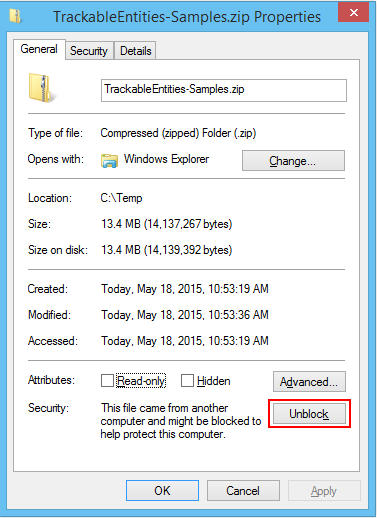

To further explore various aspects of Trackable Entities, you should have a look at the **Samples**, which you can download from the [latest release](https://github.com/tonysneed/trackable-entities/releases/latest). After downloading the **TrackableEntities-Samples.zip** file, you should first *unblock* it, by right-clicking in the File Explorer and selecting Properties. Then click the **Unblock** button.



There are samples for different versions of Visual Studio. You should use **VS2013 or later**. The VS2012 templates and samples are provided for backwards compatibility. The WebApi, WCF and Patterns samples serve as the basis for the Visual Studio templates and can help you better understand them. The other samples illustrate various aspects or use cases, such as **designer-based** models (EDMX), use of **inheritance** in model classes, and also use of a rich WPF client with the **Model-View-ViewModel** pattern (MVVM).  Each sample solution also contains a ```*.ReadMe.txt``` file with step-by-step instructions for implementing the sample.

### ASP.NET Web API
This sample demonstrates how to build an **ASP.NET Web API** application using **Trackable Entities**.  It includes various kinds of entities projects, including both *separate* and *shared* entities, as well as entities for *.NET 4.5* or greater and *portable* entities that are compatible with multiple client platforms, such as Windows Store, Windows Phone, iOS and Android.  There is also a *client console application* which uses a ```ChangeTrackingCollection``` to mark entities as Added, Modified or Deleted, so that change state may be propoagated to the service where changes can be persisted.

### Repository and Unit of Work
The **Patterns** sample illustrates how to use the **Repository and Unit of Work** patterns with an **ASP.NET Web API** application that uses **Trackable Entities**.  It uses *SimpleInjector* for **Dependency Injection** in order to *decouple* the web app from the data access layer, so that you can more easily replace the Entity Framework implementation in the future.

### Windows Communication Foundation
There is also a sample which shows how to use **Trackable Entities** with **Windows Communication Foundation** (WCF).  While Trackable Entities supports WCF, you should be aware that Microsoft has deprecated it in favor of Web API for building RESTful web services that is simpler and has better support for *modern development approaches*, which make use of Dependency Injection and Test Driven Development.

### Relations
**Trackable Entities** supports change tracking for *all types of related entities*, including 1-1, M-1 and M-M.  For example, if you have a **many-to-many** relationship between ```Employees``` and ```Territories```, removing a territory from an employee does not mean that you want to delete the territory from the database, but rather that you just want to *remove the relationship*, which is represented by an entry in an *intersection table*.  Rest assured that Trackable Entities does the right thing in this case, which would otherwise require you to use a low-level API in Entity Framework.

### Inheritance
The current version of **Trackable Entities** supports **Inheritance**, which means you can define entity classes which *inherit* from a base class, and change-tracking will work as expected.  It doesn't matter how you choose to represent inheritance in your data model (for example, *Table-Per-Hierarchy* or *Table-Per-Type*), Trackable Entities will track changes for both dervied and base class properties on the client and then persist changes properly on the service.

### Model-View-ViewModel (MVVM)
While console apps are convenient for illustrating how the client API for **Trackable Entities** works, it doesn't make for a good **real-world** example.  For that reason, there's a sample that includes a **Windows Presentation Foundation** (WPF) client which leverages the **Model-View-ViewModel** (MVVM) pattern.  Here you can see how to set up data binding for master-detail grids in which a drop down needs to be shown in the detail grid. For more information with **detailed instructions**, see this [blog post](http://blog.tonysneed.com/2014/05/28/real-world-mvvm-with-entity-framework-and-asp-net-web-api/).

### Designer-Based Models (EDMX)
Entity Framework 6 and older supports **designer-based data models**, which rely on an XML file to represent mappings between entities and database tables.  Because the file has a ```.EDMX``` extension, you'll see this referred to as **EDMX-based models**.  This is an *older approach* which has mostly been *replaced* by **code-based models**, also called Code First.  Nevertheless, **Trackable Entities** supports *designer-based models*, which may be used in brownfield applications and has better support for database *stored procedures*.  For more information on using EDMX models with Trackable Entities, including **detailed instuctions**, see this [blog post](http://blog.tonysneed.com/2014/08/01/ef-6-x-code-first-and-model-first-with-trackable-entities-2-1/).