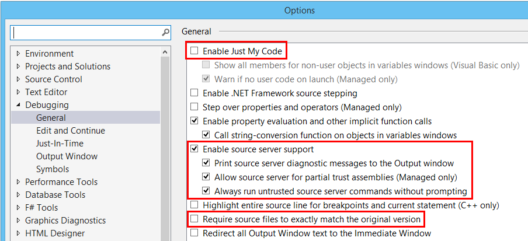
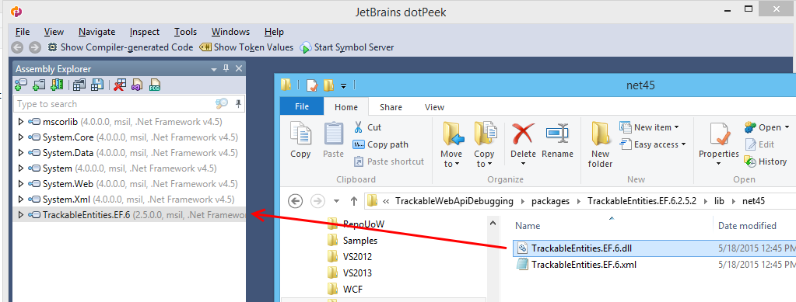
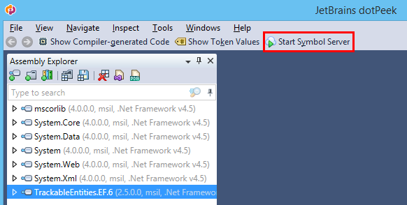
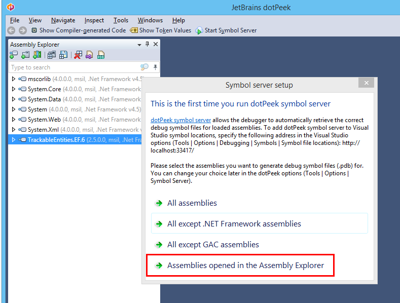
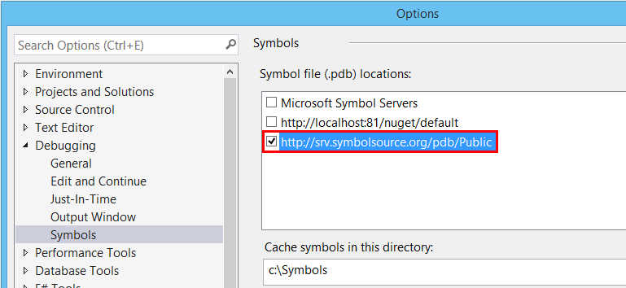
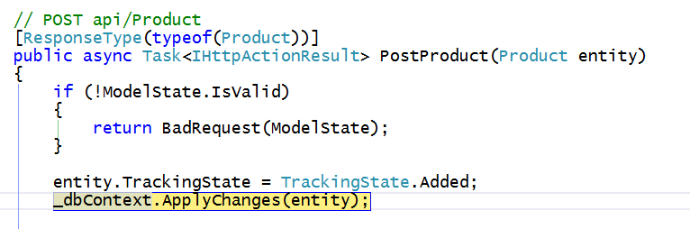
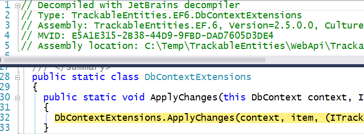

There are two basic options for **debugging** the code in **Trackable Entities**.  One is to *fork, clone or download the source code* from GitHub, then add the Visual Studio project to your solution and reference it from your app.  The other is to use the *debug symbols* downloaded from a *symbol server*.  This page describes the **second option**, which is much more straightforward.

## Symbols and Source
To debug a .NET assembly, you need both the **symbols file**, more commonly referred to as a *PDB file*, and the **source code**. For an explanation of PDB files and how they relate to source code, see this [article](http://www.wintellect.com/devcenter/jrobbins/pdb-files-what-every-developer-must-know) by John Robbins.

### Visual Studio Debugging Options
Before set up Visual Studio to debug referenced assemblies, you should set some **debug options**.  You can set these by selecting **Options and Settings** from the **Debug** menu. Here are the recommended settings:

1. *Uncheck*: **Enable Just My Code**
2. *Check*: **Enable source server support**
3. *Uncheck*: Require source files to **exactly match the original source** (optional)



## Local Symbol Server
*So how do you locate the PDB file and source code for an assembly you'd like to debug?*  Visual Studio has a built-in mechanism for downloading symbols and source from a **symbol server**, so that you can step right into the code of a referenced DLL from a **breakpoint** while you're in the middle of a debugging session.

### JetBrains dotPeek
JetBrains, the folks who invented [ReSharper](https://www.jetbrains.com/resharper/), have a free .NET decompiler [dotPeek](https://www.jetbrains.com/decompiler/). This tool has a very cool feature that allows you to set up a local **symbol server** that *generates PDB and source files on the fly*, so that you can step into the source code while debugging.  You can find detailed instructions for setting up the dotPeek symbol server in this [article](https://confluence.jetbrains.com/display/NETCOM/dotPeek+Symbol+Server+and+PDB+Generation).

### Generating Symbols for Trackable Entities
To set up dotPeek for serve up symbols for Trackable Entities, it's a good idea to add the DLL you'd like to debug to the dotPeek Assembly Explorer.  First locate the installed Trackable Entities NuGet packages by right-clicking on the solution for the your app's project, and select **Open Folder in File Explorer**.  From there drill down into the **packages** folder and open one of the T*rackable Entities packages*, then open the **lib** folder and locate the DLL for the referenced assembly.  Then simply *drag and drop* the DLL onto dotPeek in order to add it to the Assembly Explorer.



Click the **Start Symbol Server** button on the dotPeek toolbar.



The first time you start the dotPeek symbol server, you'll be prompted to set the **symbol server options**.  The most efficient approach is for the server to generate symbol files *only for assemblies opened in the Assembly Explorer*.



## Visual Studio Symbol Server Options

In order for Visual Studio to use symbols and source provided by dotPeek, you'll need to got back to the **Debug Options**, select **Symbols**, and add a **location** with the *dotPeek server URL*: ```http://localhost:33417```.



### Set Breakpoints and Step Into Source Code
Next simply set a **breakpoint** on a line of code that *calls a method* from one of the Trackable Entities libraries.  For example, you might want to step into the ```ApplyChanges``` extension method for ```DbContext``` from ```TrackableEntities.EF.6```.  First set the Web project as the solution *startup project*, then **press F5** to debug your Web API or WCF service.  When your client app invokes the service operation, you'll hit the **breakpoint** where ```ApplyChanges``` is called.



Pressing **F11** at this point will step into the ```ApplyChanges``` method, so that you can use the [debugging tools](https://msdn.microsoft.com/en-us/library/y740d9d3.aspx) of Visual Studio to see how Trackable Entities is informing Entity Framework of change state for each entity in your object graph.



You can use this same approach to step into source code for any Trackable Entities assembly, both on the client and server.
