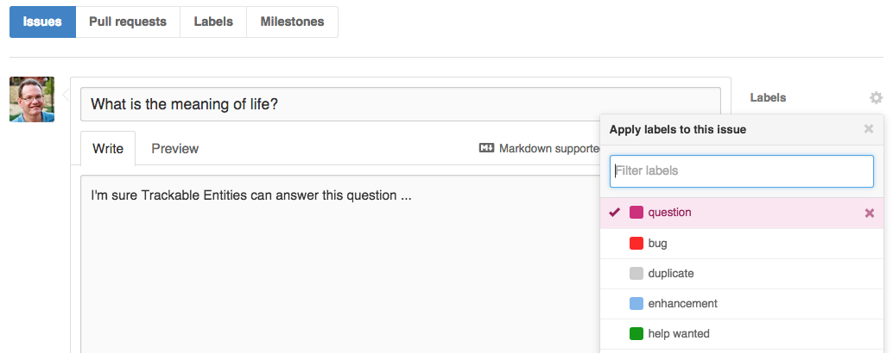

**Trackable Entities** is an *open-source* project [hosted on GitHub](https://github.com/tonysneed/trackable-entities), which has great tools for providing feedback and contributing.  Here are a few guidelines for getting involved.

## Questions, Bugs, Proposals?
If you have any **questions** about Trackable Entities you'd like answered, feel free to [post an issue](https://github.com/tonysneed/trackable-entities/issues) on the GitHub repo.  This is where you should also report **defects** or make **feature requests**.



Make use of [GitHub Flavored Markdown](https://help.github.com/articles/github-flavored-markdown/) in issues and comments. Be sure to use **\```** around ```keywords``` and ```code blocks```, and express yourself in [Emoji](http://www.emoji-cheat-sheet.com/).

## Speaking in Code
```Code``` *speaks louder than words*.  The very best way to explain an issue is to link to a **GitHub repo** you've created with a small project that reproduces the issue.  It can be a simple console app or a unit test.  I can then **fork** the repro and create a **branch** where I can make code changes.  Then I can submit a **pull request** to share the changes with you. 

If you're feeling adventurous, you can **fork** the [Trackable Entities repo](https://github.com/tonysneed/trackable-entities), then **clone** your fork and create a feature **branch**, where you can add a *failing unit test*.  When you **publish** your branch on GitHub, you'll see a button that allows you to create a **pull request** in order to share your code with me.  Then I can run the unit test to *reproduce the issue* and *issue a possible fix*.

## Learn Git and GitHub
**Every developer needs to learn Git**.  It's how open source is done, and the sooner you get on board, the more you'll benefit from all the goodness.  And **Visual Studio 2013** includes [Git integration](https://msdn.microsoft.com/en-us/library/hh850437.aspx) that makes it easy.  To get up to speed, there is a series of videos to jump start you on using **Git with Visual Studio**.

[](https://www.youtube.com/watch?v=n6u1PtmxXyg&list=PLIoX3-mcY80hBiAgmJ_i9FtDRPoeSKix0)

The other thing you'll need to learn is [GitHub](https://github.com/), which means learning the [GitHub flow](https://guides.github.com/introduction/flow/) of [forking repos](https://help.github.com/articles/fork-a-repo/), creating branches and submitting [pull requests](https://help.github.com/articles/using-pull-requests/).  A good place to start are the [GitHub Guides](https://guides.github.com/activities/hello-world/).  There's also [GitHub integration](http://blogs.msdn.com/b/visualstudio/archive/2015/04/30/announcing-the-github-extension-for-visual-studio.aspx) coming to Visual Studio 2015.

[](https://www.youtube.com/playlist?list=PLg7s6cbtAD15G8lNyoaYDuKZSKyJrgwB-)

## Contributing
*I'm happy to accept contributions!*  If you have an idea or would like to contribute, start by creating a [new issue](https://github.com/tonysneed/trackable-entities/issues), where we can discuss it.  Please **create an issue** *before submitting a pull request*.  Then, if we're on the same page about what needs to be done, you can then submit a pull request with your new feature or contribution.  Here are some helpful articles on best practices for submitting pull requests to open source projects.

- [Open Source Contribution Etiquette](http://tirania.org/blog/archive/2010/Dec-31.html)
- [Don't "Push" Your Pull Requests](https://www.igvita.com/2011/12/19/dont-push-your-pull-requests/)

## Help Wanted

Trackable Entities is based on a set of **constantly evolving technologies**, and to keep up it need to *adapt to new platforms and technologies*.  Here is a list of areas where you can contribute and make a difference.

### 1. Entity Framework 7
EF7 is a complete re-write of Entity Framework from the ground up, and Trackable Entities will need to have an implementation that uses the new API, which should actually be easier that EF6. Who knows, maybe you'll end up contributing the EF project as well!

### 2. ASP.NET 5 (vNext)
ASP.NET Web API will have a completely new runtime and project structure.  We'll need to create new project templates for that, and I could use some help.

### 3. No SQL
A future version of Entity Framework will allow you to use a **No SQL** database such as [Redis](http://en.wikipedia.org/wiki/Redis).  It would be great if Trackable Entities could be used for applying batch updates to non-relational databases too.

### 4. TypeScript
[TypeScript](http://www.typescriptlang.org/Tutorial) is a superset of JavaScript that adds static typing for greater maintainability and to help development tools provide things like statement completion and refactoring.  Angular 2 is being built with TypeScript.  While Trackable Entities offers client-side change-tracking for .NET clients (as well as for iOS and Android), it would be great to have change-tracking available for JavaScript clients as well.

### 5. General Help
If you're not too comfortable with any of these technologies but would still like to help, please let me know.  I need a great deal of assistance with things like testing, tools and samples.  If you want to help in a general way, I'd be happy to teach you what you need to know.

*I look forward to hearing your ideas and seeing your code!*
